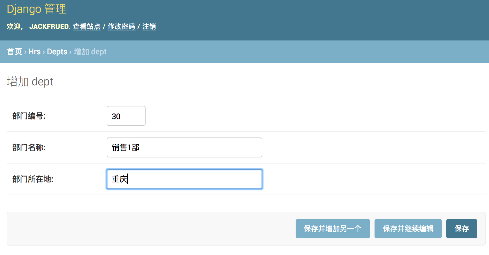
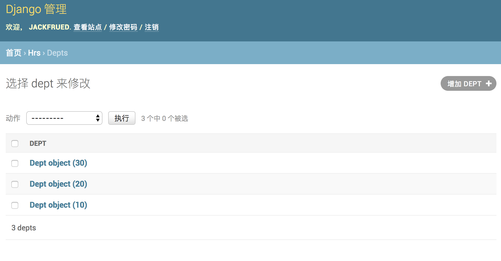

<h4>一、准备工作</h4>
1.检查Python环境:Django1.11需要Python2.7或Python3.4以上的版本；Django2.0需要Python3.4以上的版本。

```
  > python --version

  > python3
  >>> import sys
  >>> sys.version
  >>> sys.version_info
```
2.创建一个项目文件夹并切换到该目录
```
  > E:
  E:/> mkdir myvenv
  E:/> cd myvenv
```
3.创建并虚拟环境到文件夹venv中
```
  E:/myvenv> python -m venv venv
```
4.激活虚拟环境
```
  E:/myvenv> cd venv
  E:/myvenv/venv> cd scripts
  E:/myvenv/venv/scripts> activate.bat # 激活文件
  (venv)E:/myvenv/venv/scripts>
```
5.更新包管理工具pip
```
  (venv)E:/myvenv/venv/scripts> cd /
  (venv)E:/>python -m pip install --upgrade pip
```
> 注意：请注意终端提示符发生的变化，前面的(venv)说明我们已经进入虚拟环境，而虚拟环境下的python和pip已经是Python 3的解释器和包管理工具了。

6.安装django
```
  (venv)E:/> pip install django
  # 如果需要指定django的版本
  (venv)E:/> pip install django==1.11
```
7.检查各种环境下django版本
```
  (venv)E:/> python -m django --version
  (venv)E:/> django-admin --version
```
```
  (venv)E:/> python
  >>> import django
  >>> django.get_version()
```
8.django版本对应的python版本


| Django版本 | Python版本            |
| -------- | ------------------- |
| 1.8      | 2.7、3.2、3.3、3.4、3.5 |
| 1.9、1.10 | 2.7、3.4、3.5         |
| 1.11     | 2.7、3.4、3.5、3.6     |
| 2.0      | 3.4、3.5、3.6         |
9.使用Django-admin创建项目，项目命名为day1
```
  (venv)E:/> cd myvenv
  (venv)E:/myvenv> django-admin startproject day1 .
```
> 注意：上面命令最后的那个点，表示在当前路径下创建项目

执行上面的命令过后看看生成的文件和文件夹，他们的作用如下所示:
```
  day1/ manage.py： 一个让你用各种方式管理 Django 项目的命令行工具。
  day1/day1/ __init__.py：一个空文件，告诉 Python 这个目录应该被认为是一个 Python 包。
  day1/day1/ settings.py：Django 项目的配置文件。
  day1/day1/ urls.py：Django 项目的 URL 声明，就像你网站的“目录”。
  day1/day1/ wsgi.py：作为你的项目的运行在 WSGI 兼容的Web服务器上的入口。
```
10.启动服务器运行项目
```
  (venv)E:/day1> python manage.py runserver
```

> 说明1：刚刚启动的是Django的自带的用于开发和测试的服务器，它是一个用纯的Python编写的轻量级的Web服务器，但它并不是真正意义上的生产级别的服务器，千万不要将这个服务器用于和生产环境相关的任何地方。

> 说明2：用于开发的服务器在需要的情况下会对每一次的访问请求重新载入一遍的Python代码所以你不需要为了让修改的代码生效而频繁的重新启动服务器然而，一些动作，比如添加新文件，将不会触发自动重新加载，这时你得自己手动重启服务器。

> 说明3：通过可以python manage.py help命令查看可用命令列表;在启动服务器时，也可以通过python manage.py runserver 1.2.3.4:56789来指定绑定的IP地址和端口。

> 说明4：可以通过Ctrl + C键来终止服务器的运行。

11.修改settings.py配置文件，django是一个支持国际化和本地化的框架，因此我们刚刚看到的默认首页也是支持国际化 的，我们要将默认语言改为中文，时区设置为东八区
```
  (venv)E:/day1/day1> settings.py
  # 可以在pycharm中打开，并编辑
```
```
  # 设置语言代码
  LANGUAGE_CODE = 'zh-hans'
  # 设置时区
  TIME_ZONE = 'Asia/Chongqing'
```
12.回到anage.py的目录，刷新刚才的页面
```
  (venv)E:/day1/day1> python manage.py runserver
```


<hr/>
<h4>二、动态页面</h4>

1.创建名为yun的应用（一个项目可以有多个项目）

```
  (venv)E:/day1> python manage.py startapp yun
```
执行上面命令后会在当前路径下创建yun目录，其目录结构如下所示:
```
  *__init__.py：一个空文件，告诉 Python 这个目录应该被认为是一个 Python 包。
  *admin.py：可以用来注册模型，让Django自动创建管理界面。
  *apps.py：当前应用的配置。
  *migrations：存放与模型有关的数据库迁移信息。
    *__init__.py：一个空文件，告诉 Python 这个目录应该被认为是一个 Python 包。
  *models.py：存放应用的数据模型，即实体类及其之间的关系（MVC/MVT中的M）。
  *tests.py：包含测试应用各项功能的测试类和测试函数。
  *views.py：处理请求并返回响应的函数（MVC中的C，MVT中的V）。
```
2.在pychar2.在pycharm打开应用目录修改视图文件<span>views.py</span>
```
  from django.http import HttpResponse


  def hello(request):
      return HttpResponse('<h1>Hello, Django!</h1>')
```
3.在应用hello目录创建一个urls.py文件并映射URL
```
  from django.urls import path

  from yun import views

  urlpatterns = [
      path('', views.hello, name='hello'),
  ]
```
> 说明：上面使用的path函数是Django 2.x中新添加的函数，除此之外还有re_path是支持正则表达式的URL映射函数；Django 1.x中是用url函数来设定URL映射。

4.切换到项目day1目录，修改该目录下的urls.py文件，对应用中设定的URL进行合并。
```
  from django.contrib import admin
  from django.urls import path, include

  urlpatterns = [
      path('admin/', admin.site.urls),
      path('yun/', include('yun.urls')),
  ]
```
5.启动项目并访问应用
```
  (venv)E:/day1> python manage.py runserver
```
在浏览器中访问http://localhost:8000/yun。

> 说明：如果想实现远程访问，需要先确认防火墙是否已经打开了8000端口，而且需要在配置文件settings.py中修改ALLOWED_HOSTS的设置，添加一个'*'表示允许所有的客户端访问Web应用。

<hr/>
<h4>三、配置关系型数据库MySQL</h4>

1.修改项目的settings.py文件，

```
  INSTALLED_APPS = [
    'django.contrib.admin',
    'django.contrib.auth',
    'django.contrib.contenttypes',
    'django.contrib.sessions',
    'django.contrib.messages',
    'django.contrib.staticfiles',
    'yun',
  ]

  DATABASES = {
    'default': {
        'ENGINE': 'django.db.backends.mysql',
        'NAME': 'yunyi',
        'HOST': 'localhost',
        'PORT': 3306,
        'USER': 'root',
        'PASSWORD': '123456',
      }
    }
```
在配置ENGINE属性时，常用的可选值包括：

```
 'django.db.backends.sqlite3'：SQLite嵌入式数据库。
  'django.db.backends.postgresql'：BSD许可证下发行的开源关系型数据库产品。
  'django.db.backends.mysql'：转手多次目前属于甲骨文公司的经济高效的数据库产品。
  'django.db.backends.oracle'：甲骨文公司的关系型数据库旗舰产品。
```
其他的配置可以参考官方文档中数据库配置的部分。

> NAME属性代表数据库的名称，如果使用SQLite它对应着一个文件，在这种情况下NAME的属性值应该是一个绝对路径；使用其他关系型数据库，则要配置对应的HOST（主机）、PORT（端口）、USER（用户名）、PASSWORD（口令）等属性。
> 2.安装MySQL客户端工具，python3中使用pymysql，python2中用MySQLdb
```
  (venv)E:/day1> pip install pymysql
```
>如果使用Python 3需要修改项目的__init__.py文件并加入如下所示的代码，这段代码的作用是将PyMySQL视为MySQLdb来使用，从而避免Django找不到连接MySQL的客户端工具而询问你：“Did you install mysqlclient? ”（你安装了mysqlclient吗？）。

```
  import pymysql

  pymysql.install_as_MySQLdb()
```
3.运行manage.py并指定migrate参数实现数据库迁移，为应用程序创建对应的数据表，当然在此之前需要先启动MySQL数据库服务器并创建名为oa的数据库，在MySQL中创建数据库的语句如下所示。
```
  drop database if exists oa;
  create database oa default charset utf8;
```

```
  (venv)E:/day1> python manage.py migrate
  Operations to perform:
    Apply all migrations: admin, auth, contenttypes, sessions
  Running migrations:
    Applying contenttypes.0001_initial... OK
    Applying auth.0001_initial... OK
    Applying admin.0001_initial... OK
    Applying admin.0002_logentry_remove_auto_add... OK
    Applying contenttypes.0002_remove_content_type_name... OK
    Applying auth.0002_alter_permission_name_max_length... OK
    Applying auth.0003_alter_user_email_max_length... OK
    Applying auth.0004_alter_user_username_opts... OK
    Applying auth.0005_alter_user_last_login_null... OK
    Applying auth.0006_require_contenttypes_0002... OK
    Applying auth.0007_alter_validators_add_error_messages... OK
    Applying auth.0008_alter_user_username_max_length... OK
    Applying auth.0009_alter_user_last_name_max_length... OK
    Applying sessions.0001_initial... OK
```
4.可以看到，Django帮助我们创建了10张表，这些都是使用Django框架需要的东西，稍后我们就会用到这些表。除此之外，我们还应该为我们自己的应用创建数据模型。如果要在yun应用中实现对部门和员工的管理，我们可以创建如下所示的数据模型。
```
  class Dept(models.Model):
      """部门类"""

      no = models.IntegerField(primary_key=True, db_column='dno', verbose_name='部门编号')
      name = models.CharField(max_length=20, db_column='dname', verbose_name='部门名称')
      location = models.CharField(max_length=10, db_column='dloc', verbose_name='部门所在地')

      class Meta:
          db_table = 'tb_dept'


  class Emp(models.Model):
      """员工类"""

      no = models.IntegerField(primary_key=True, db_column='eno', verbose_name='员工编号')
      name = models.CharField(max_length=20, db_column='ename', verbose_name='员工姓名')
      job = models.CharField(max_length=10, verbose_name='职位')
      # 自参照完整性多对一外键关联
      mgr = models.ForeignKey('self', on_delete=models.SET_NULL, null=True, blank=True, verbose_name='主管编号')
      sal = models.DecimalField(max_digits=7, decimal_places=2, verbose_name='月薪')
      comm = models.DecimalField(max_digits=7, decimal_places=2, null=True, blank=True, verbose_name='补贴')
      # 多对一外键关联
      dept = models.ForeignKey(Dept, db_column='dno', on_delete=models.PROTECT, verbose_name='所在部门')

      class Meta:
          db_table = 'tb_emp'
```
> 说明：上面定义模型时使用了字段类及其属性，其中IntegerField对应数据库中的integer类型，CharField对应数据库的varchar类型，DecimalField对应数据库的decimal类型，ForeignKey用来建立多对一外键关联。字段属性primary_key用于设置主键，max_length用来设置字段的最大长度，db_column用来设置数据库中与字段对应的列，verbose_name则设置了Django后台管理系统中该字段显示的名称。如果对这些东西感到很困惑也不要紧，文末提供了字段类、字段属性、元数据选项等设置的相关说明，不清楚的读者可以稍后查看对应的参考指南。

5.通过模型创建数据表。
```
  (venv)E:/day1> python manage.py makemigrations yun

  Migrations for 'yun':
    yun/migrations/0001_initial.py
      - Create model Dept
      - Create model Emp
  (venv)E:/day1> python manage.py migrate

  Operations to perform:
    Apply all migrations: admin, auth, contenttypes, hrs, sessions
  Running migrations:
    Applying hrs.0001_initial... OK
```

执行完数据模型迁移操作之后，可以在通过图形化的MySQL客户端工具查看到E-R图（实体关系图）。


<hr/>
<h4>四、在后台管理模型</h4>

1.创建超级管理员账号。
```
  (venv)E:/day1> python manage.py createsuperuser

  Username (leave blank to use 'hao'): jackfrued
  Email address: jackfrued@126.com
  Password:
  Password (again):
  Superuser created successfully.
```
2.启动Web服务器，登录后台管理系统。
```
  (venv)E:/day1> python manage.py runserver
```
访问http://127.0.0.1:8000/admin，会来到如下图所示的登录界面。


登录后进入管理员操作平台。


至此我们还没有看到之前创建的模型类，需要在应用的admin.py文件中模型进行注册。

3.进入应用文件admin.py注册模型类。
```
  from django.contrib import admin

  from hrs.models import Emp, Dept

  admin.site.register(Dept)
  admin.site.register(Emp)
```
注册模型类后，就可以在后台管理系统中看到它们。


4.对模型进行CRUD操作。

可以在管理员平台对模型进行C（新增）R（查看）U（更新）D（删除）操作，如下图所示。

添加新的部门。



查看所有部门。



更新和删除部门。


5.注册模型管理类。

再次修改admin.py文件，通过注册模型管理类，可以在后台管理系统中更好的管理模型。
  ```
  from django.contrib import admin

  from hrs.models import Emp, Dept


  class DeptAdmin(admin.ModelAdmin):

      list_display = ('no', 'name', 'location')
      ordering = ('no', )


  class EmpAdmin(admin.ModelAdmin):

      list_display = ('no', 'name', 'job', 'mgr', 'sal', 'comm', 'dept')
      search_fields = ('name', 'job')


  admin.site.register(Dept, DeptAdmin)
  admin.site.register(Emp, EmpAdmin)
  ```


为了更好的查看模型数据，可以为Dept和Emp两个模型类添加__str__魔法方法。
```
  from django.db import models


  class Dept(models.Model):
      """部门类"""

      # 此处省略上面的代码

      def __str__(self):
          return self.name

      # 此处省略下面的代码


  class Emp(models.Model):
      """员工类"""

      # 此处省略上面的代码

      mgr = models.ForeignKey('self', on_delete=models.SET_NULL, null=True, blank=True, verbose_name='直接主管')

      # 此处省略下面的代码

      # 此处省略上面的代码

      def __str__(self):
          return self.name
```
修改代码后刷新查看Emp模型的页面，效果如下图所示。


<hr/>
<h4>五、使用ORM完成模型的CRUD操作</h4>

在了解了Django提供的模型管理平台之后，我们来看看如何从代码层面完成对模型的CRUD（Create / Read / Update / Delete）操作。我们可以通过manage.py开启Shell交互式环境，然后使用Django内置的ORM框架对模型进行CRUD操作。

```
  (venv)E:/day1> python manage.py shell

  Python 3.6.4 (v3.6.4:d48ecebad5, Dec 18 2017, 21:07:28)
  [GCC 4.2.1 (Apple Inc. build 5666) (dot 3)] on darwin
  Type "help", "copyright", "credits" or "license" for more information.
  (InteractiveConsole)
  >>>
```
**新增**
```
  >>>
  >>> from hrs.models import Dept, Emp
  >>> dept = Dept(40, '研发2部', '深圳')
  >>> dept.save()
```
**更新**
```
  >>>
  >>> dept.name = '研发3部'
  >>> dept.save()
```
**查询**

查询所有对象。

```
  >>>
  >>> Dept.objects.all()
  <QuerySet [<Dept: 研发1部>, <Dept: 销售1部>, <Dept: 运维1部>, <Dept: 研发3部>]>
```
过滤数据。
```
  >>>
  >>> Dept.objects.filter(name='研发3部') # 查询部门名称为“研发3部”的部门
  <QuerySet [<Dept: 研发3部>]>
  >>>
  >>> Dept.objects.filter(name__contains='研发') # 查询部门名称包含“研发”的部门(模糊查询)
  <QuerySet [<Dept: 研发1部>, <Dept: 研发3部>]>
  >>>
  >>> Dept.objects.filter(no__gt=10).filter(no__lt=40) # 查询部门编号大于10小于40的部门
  <QuerySet [<Dept: 销售1部>, <Dept: 运维1部>]>
  >>>
  >>> Dept.objects.filter(no__range=(10, 30)) # 查询部门编号在10到30之间的部门
  <QuerySet [<Dept: 研发1部>, <Dept: 销售1部>, <Dept: 运维1部>]>
```
查询单个对象。
```
  >>>
  >>> Dept.objects.get(pk=10)
  <Dept: 研发1部>
  >>>
  >>> Dept.objects.get(no=20)
  <Dept: 销售1部>
  >>>
  >>> Dept.objects.get(no__exact=30)
  <Dept: 运维1部>
```
排序数据。
```
  >>>
  >>> Dept.objects.order_by('no') # 查询所有部门按部门编号升序排列
  <QuerySet [<Dept: 研发1部>, <Dept: 销售1部>, <Dept: 运维1部>, <Dept: 研发3部>]>
  >>>
  >>> Dept.objects.order_by('-no') # 查询所有部门按部门编号降序排列
  <QuerySet [<Dept: 研发3部>, <Dept: 运维1部>, <Dept: 销售1部>, <Dept: 研发1部>]>
```
切片数据。
```
  >>>
  >>> Dept.objects.order_by('no')[0:2] # 按部门编号排序查询1~2部门
  <QuerySet [<Dept: 研发1部>, <Dept: 销售1部>]>
  >>>
  >>> Dept.objects.order_by('no')[2:4] # 按部门编号排序查询3~4部门
  <QuerySet [<Dept: 运维1部>, <Dept: 研发3部>]>
```
高级查询。
```
  >>>
  >>> Emp.objects.filter(dept__no=10) # 根据部门编号查询该部门的员工
  <QuerySet [<Emp: 乔峰>, <Emp: 张无忌>, <Emp: 张三丰>]>
  >>>
  >>> Emp.objects.filter(dept__name__contains='销售') # 查询名字包含“销售”的部门的员工
  <QuerySet [<Emp: 黄蓉>]>
  >>>
  >>> Dept.objects.get(pk=10).emp_set.all() # 通过部门反查部门所有的员工
  <QuerySet [<Emp: 乔峰>, <Emp: 张无忌>, <Emp: 张三丰>]>
```
> 说明1：由于员工与部门之间存在多对一外键关联，所以也能通过部门反向查询该部门的员工（从一对多关系中“一”的一方查询“多”的一方），反向查询属性默认的名字是类名小写_set（如上面例子中的emp_set），当然也可以在创建模型时通过ForeingKey的related_name属性指定反向查询属性的名字。如果不希望执行反向查询可以将related_name属性设置为'+'或以'+'开头的字符串。

> 说明2：查询多个对象的时候返回的是QuerySet对象，QuerySet使用了惰性查询，即在创建QuerySet对象的过程中不涉及任何数据库活动，等真正用到对象时（求值QuerySet）才向数据库发送SQL语句并获取对应的结果，这一点在实际开发中需要引起注意！

> 说明3：可以在QuerySet上使用update()方法一次更新多个对象。

**删除**
```
  >>>
  >>> Dept.objects.get(pk=40).delete()
  (1, {'hrs.Dept': 1})
```

<hr/>
<h4>六、Django模型最佳实践</h4>

```
  1.正确的为模型和关系字段命名。
  2.设置适当的related_name属性。
  3.用OneToOneField代替ForeignKeyField(unique=True)
  4.通过“迁移操作”（migrate）来添加模型。
  5.用NoSQL来应对需要降低范式级别的场景。
  6.如果布尔类型可以为空要使用NullBooleanField
  7.在模型中放置业务逻辑。
  8.用<ModelName>.DoesNotExists取代ObjectDoesNotExists
  9.在数据库中不要出现无效数据。
  10.不要对QuerySet调用len()函数。
  11.将QuerySet的exists()方法的返回值用于if条件。
  12.用DecimalField来存储货币相关数据而不是FloatField。
  13.定义__str__方法。
  14.不要将数据文件放在同一个目录中。
```
> 说明：以上内容来自于STEELKIWI网站的Best Practice working with Django models in Python，有兴趣的小伙伴可以阅读原文。

<hr/>
<h4>模型定义参考</h4>

**字段**

对字段名称的限制
<ul>
  <li>字段名不能是Python的保留字，否则会导致语法错误</li>
  <li>字段名不能有多个连续下划线，否则影响ORM查询操作</li>
</ul>
Django模型字段类


| 字段类                   | 说明                                       |
| --------------------- | ---------------------------------------- |
| AutoField             | 自增ID字段                                   |
| BigIntegerField       | 64位有符号整数                                 |
| BinaryField           | 存储二进制数据的字段，对应Python的bytes类型              |
| BooleanField          | 存储True或False                             |
| CharField             | 长度较小的字符串                                 |
| DateField             | 存储日期，有auto_now和auto_now_add属性            |
| DateTimeField         | 存储日期和日期，两个附加属性同上                         |
| DecimalField          | 存储固定精度小数，有max_digits（有效位数）和decimal_places（小数点后面）两个必要的参数 |
| DurationField         | 存储时间跨度                                   |
| EmailField            | 与CharField相同，可以用EmailValidator验证         |
| FileField             | 文件上传字段                                   |
| FloatField            | 存储浮点数                                    |
| ImageField            | 其他同FileFiled，要验证上传的是不是有效图像               |
| IntegerField          | 存储32位有符号整数。                              |
| GenericIPAddressField | 存储IPv4或IPv6地址                            |
| NullBooleanField      | 存储True、False或null值                       |
| PositiveIntegerField  | 存储无符号整数（只能存储正数）                          |
| SlugField             | 存储slug（简短标注）                             |
| SmallIntegerField     | 存储16位有符号整数                               |
| TextField             | 存储数据量较大的文本                               |
| TimeField             | 存储时间                                     |
| URLField              | 存储URL的CharField                          |
| UUIDField             | 存储全局唯一标识符                                |

**字段属性**

通用字段属性


| 选项             | 说明                                       |
| -------------- | ---------------------------------------- |
| null           | 数据库中对应的字段是否允许为NULL，默认为False              |
| blank          | 后台模型管理验证数据时，是否允许为NULL，默认为False           |
| choices        | 设定字段的选项，各元组中的第一个值是设置在模型上的值，第二值是人类可读的值    |
| db_column      | 字段对应到数据库表中的列名，未指定时直接使用字段的名称              |
| db_index       | 设置为True时将在该字段创建索引                        |
| db_tablespace  | 为有索引的字段设置使用的表空间，默认为DEFAULT_INDEX_TABLESPACE |
| default        | 字段的默认值                                   |
| editable       | 字段在后台模型管理或ModelForm中是否显示，默认为True         |
| error_messages | 设定字段抛出异常时的默认消息的字典，其中的键包括null、blank、invalid、invalid_choice、unique和unique_for_date |
| help_text      | 表单小组件旁边显示的额外的帮助文本。                       |
| primary_key    | 将字段指定为模型的主键，未指定时会自动添加AutoField用于主键，只读。   |
| unique         | 设置为True时，表中字段的值必须是唯一的                    |
| verbose_name   | 字段在后台模型管理显示的名称，未指定时使用字段的名称               |

ForeignKey属性

1.limit_choices_to：值是一个Q对象或返回一个Q对象，用于限制后台显示哪些对象。

2.related_name：用于获取关联对象的关联管理器对象（反向查询），如果不允许反向，该属性应该被设置为'+'，或者以'+'结尾。

3.to_field：指定关联的字段，默认关联对象的主键字段。

4.db_constraint：是否为外键创建约束，默认值为True。

5.on_delete：外键关联的对象被删除时对应的动作，可取的值包括django.db.models中定义的：
```
  CASCADE：级联删除。
  PROTECT：抛出ProtectedError异常，阻止删除引用的对象。
  SET_NULL：把外键设置为null，当null属性被设置为True时才能这么做。
  SET_DEFAULT：把外键设置为默认值，提供了默认值才能这么做。
```
ManyToManyField属性
```
  symmetrical：是否建立对称的多对多关系。
  through：指定维持多对多关系的中间表的Django模型。
  throughfields：定义了中间模型时可以指定建立多对多关系的字段。
  db_table：指定维持多对多关系的中间表的表名。
```
**模型元数据选项**


| 选项                    | 说明                                       |
| --------------------- | ---------------------------------------- |
| abstract              | 设置为True时模型是抽象父类                          |
| app_label             | 如果定义模型的应用不在INSTALLED_APPS中可以用该属性指定       |
| db_table              | 模型使用的数据表名称                               |
| db_tablespace         | 模型使用的数据表空间                               |
| default_related_name  | 关联对象回指这个模型时默认使用的名称，默认为<model_name>_set   |
| get_latest_by         | 模型中可排序字段的名称。                             |
| managed               | 设置为True时，Django在迁移中创建数据表并在执行flush管理命令时把表移除 |
| order_with_respect_to | 标记对象为可排序的                                |
| ordering              | 对象的默认排序                                  |
| permissions           | 创建对象时写入权限表的额外权限                          |
| default_permissions   | 默认为('add', 'change', 'delete')           |
| unique_together       | 设定组合在一起时必须独一无二的字段名                       |
| index_together        | 设定一起建立索引的多个字段名                           |
| verbose_name          | 为对象设定人类可读的名称                             |
| verbose_name_plural   | 设定对象的复数名称                                |

**查询参考**

按字段查找可以用的条件：
```
  exact / iexact：精确匹配/忽略大小写的精确匹配查询
  contains / icontains / startswith / istartswith / endswith / iendswith：基于like的模糊查询
  in：集合运算
  gt / gte / lt / lte：大于/大于等于/小于/小于等于关系运算
  range：指定范围查询（SQL中的between…and…）
  year / month / day / week_day / hour / minute / second：查询时间日期
  isnull：查询空值（True）或非空值（False）
  search：基于全文索引的全文检索
  regex / iregex：基于正则表达式的模糊匹配查询
```
Q对象（用于执行复杂查询）的使用：
```
  >>>
  >>> from django.db.models import Q
  >>> Emp.objects.filter(
  ...     Q(name__startswith='张'),
  ...     Q(sal__gte=5000) | Q(comm__gte=1000)
  ... ) # 查询名字以“张”开头且工资大于等于5000或补贴大于等于1000的员工
  <QuerySet [<Emp: 张三丰>]>
```
